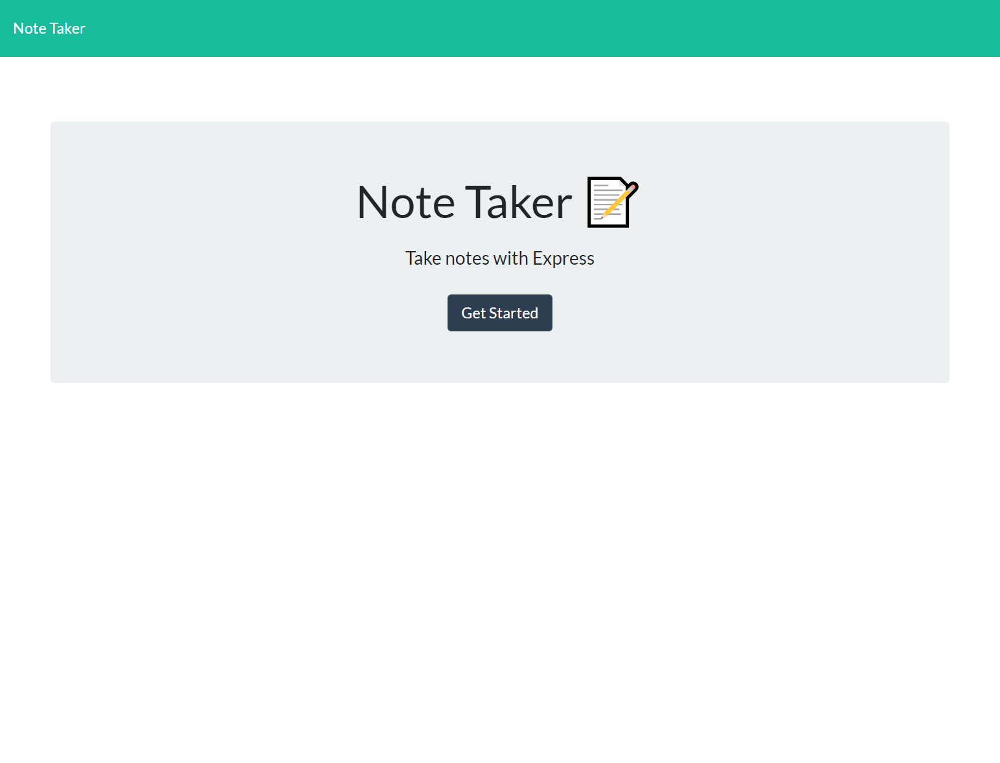
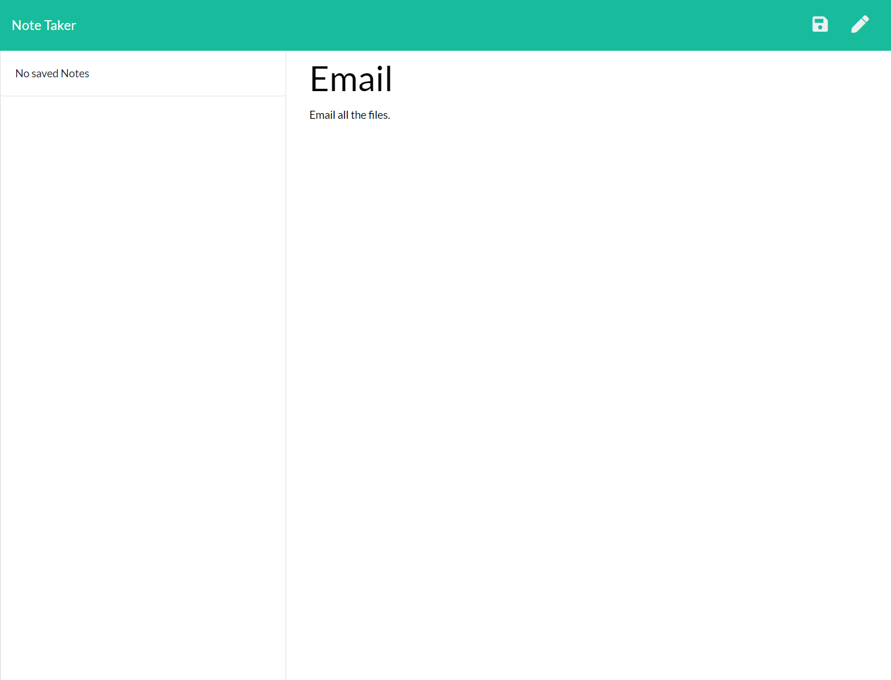

# Note Taker Application

##  Note Taking Application that uses Express.js

## Installation

    * npm install

## Tests
    * You can clone the repository and make sure all npm packaage is installed to your terminal.
    * Use npm run start
    * or Use npm run dev

## Screenshot of the Project

## 
## 

## Github URL
   https://github.com/ArlonTuazon/note_taker
   
## Heroku URL
   https://arlon-notetaker.herokuapp.com.

## Deployed URL
   http://localhost:5000
   http://localhost:5000/notes.html.
  

